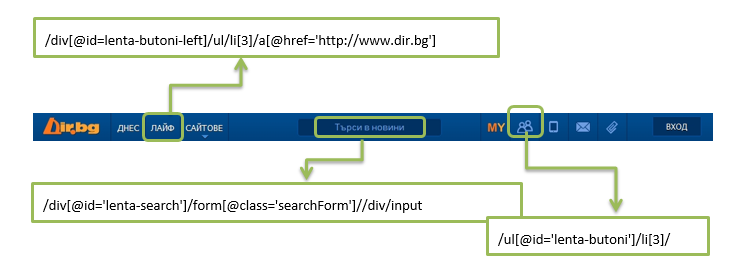
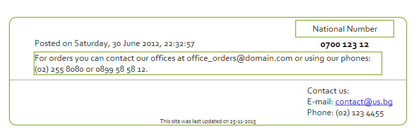

# Homework
## Selenium IDE
### Fix the XPath

 * Go to the following web page [www.dir.bg](http://www.dir.bg) and try to find the elements by their XPath.
Below there are some XPaths, to use them you have to fix them a bit. Make the necessary changes and locate the elements.

As a result of this task you have to prepare Selenium Test case with the three correct XPaths.
 

### Create Automated Test
Below are some sample workflows. Create Selenium Test cases for them.

## **Google Test Case**
1.	Open Firefox Browser 
2.	Open Selenium IDE (and minimize)
3.	In the address bar, type [http://www.google.com/](http://www.google.com/)
4.	AssertTitle Google 
5.	In the search input button, Type "QA Testing" 
6.	Click on the "Google Search" submit button 
7.	Wait for Search Results to be shown in the next page 
8.	Assert the browsers title has the value "qa testing - Google Търсене" 
9.	Verify "QA Testing" text is present anywhere in the search results

After finishing your recording: 
* Stop recording 
* Save the test case 
* Run the test case 
* Review the test case and fix any errors 
	* Option 1
		* Fast to slow 
	* Option 2 
		* setSpeed 
	* Option 3 
		* pause 
	* Option 4 
		* Change AssertTitle to waitForTitle 
		* Change VerifyTextPresent to waitForTextPresent 
* Save the reviewed test case 

### **BG Coder Test Case**
1.	Open [http://bgcoder.com](http://bgcoder.com)
2.	Verify the “Вход” link button is present and click on it
3.	Wait for the next page to be shown
4.	Verify the name for forgotten password button is exactly “Forgot your password?” and click on it
5.	Assert that the browser’s title has the value " Forgotten password - BGCoder.com"
6.	Click the “Submit“ button
7.	Verify that the user is prompted to fill in the empty field

### **Make a record Test Case**
* Go to [http://demos.kendoui.com/web/listview/editing.html](http://demos.kendoui.com/web/listview/editing.html). Click the “Add new record” button. Save the record without entering values in the Product Name and Unit Price fields. Verify that the user is prompted to fill in the empty fields.
* Open [http://demos.kendoui.com/web/listview/editing.html](http://demos.kendoui.com/web/listview/editing.html). Think about appropriate test case and try to create an automated test for it.

### **Slider Test Case**
* Open [http://demos.kendoui.com/web/slider/api.html](http://demos.kendoui.com/web/slider/api.html). In the input with id=”newValue” write “4” and click on “Set Value”. Verify that the correct value is shown on the slider.
* Open [http://demos.kendoui.com/web/slider/api.html](http://demos.kendoui.com/web/slider/api.html). Think about appropriate test case and try to create an automated test for it.

### **QueueMetrics Test Case**
Open [http://demo.loway.ch/queuemetrics-livedemo/frontPage.jsp](http://demo.loway.ch/queuemetrics-livedemo/frontPage.jsp). Enter "demo" for username and "demo" for password. In the drop down list for Agent report select the option to filter by Mara (301). Click on “Today” link to see her Quick reports. If the Period start date is matching the current date, alert a message “Matching”, otherwise alert “Not Matching”.
 
Tips: The start hour always should be 00:00 

### **Store.bg Test Cases**
* Open [http://www.book.store.bg](http://www.book.store.bg). In the textbox with name “srchstr” write “JavaScript” and click on “Търси”. Verify that the results are for JavaScript.
* Open [http://www.book.store.bg](http://www.book.store.bg). In the textbox write “JavaScript”. Verify that the radio button „всички раздели” is selected and select „само в книги“. Click on “Търси” and verify that above the search results the correct search options are shown.
* Open [http://www.book.store.bg](http://www.book.store.bg). In the textbox write “JavaScript”. Verify that the radio button „всички раздели” is selected and select „само в книги“. Click on “Търси” and verify that the first book in the search results is about JavaScript (use regular expressions). Store the title of the book in a variable. Follow the link to the book (the title of the book). Then click to see the window for calculation of a delivery for another town („щракнете тук“). Verify that the popup that opens contains the title of the book. Use the stored variable for the verification.
* Open [http://www.book.store.bg](http://www.book.store.bg). If the radio button “всички раздели” is clicked search for “Melanie Delon”. If the other radio button is clicked, first click on “всички раздели” and then do the same search. Verify the search results.
* Try to create an automated test by writing it yourself without using the record option.
* Create a Test Suite containing all those tests.

### Regular Expressions Results
If you use the following regular expressions what will be a possible result?
 

 Regular Expression | Result (Xpath)|
| ------------- |:-------------:|
| [A-z0-9._%+-]+@[A-z0-9.-]+\.[A-z]{2,4} ||
|\\(+[0-9]{2}+\)+\s+[0-9]{3}+\s+[0-9]{4}||
|\d{4}\s\d{3}\s\d{2} ||
| \d{2}-\d{2}-\d{4} ||
| \w+\,+\s+\d{1,2}\s+\w+\s+\d{4}\,+\s+\d{2}\:\d{2}\:\d{2} ||

Use these expressions to verify that text is present in the html file Index.html. Prepare Selenium Test Case with verifications.

