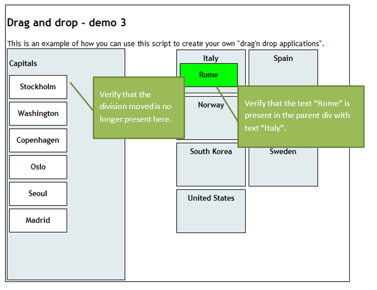
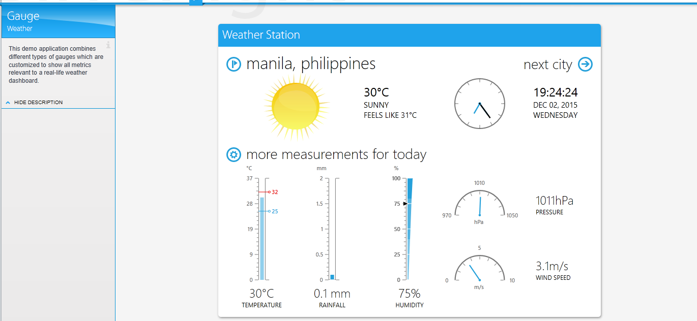

# Test Studio Homework
## Flashback

So far you saw Selenium tool for test automation and in order to compare them try to create the same tests as in the previous homework this time using Test Studio.

### Create Automated Test (Selenium->Test Studio)

Below are some sample workflows. Create Tests for them. 
* Open [http://www.book.store.bg](http://www.book.store.bg). In the textbox with name “srchstr” write “Java Script” and click on “Търси”. Verify that the results are for Java Script. 
* Open [http://www.book.store.bg](http://www.book.store.bg). In the textbox write “Java Script”. Verify that the radio button „всички раздели” is selected and select „само в книги“. Click on “Търси” and verify that above the search results the correct search options are shown. 
* Open [http://www.book.store.bg](http://www.book.store.bg). In the textbox write “Java Script”. Verify that the radio button „всички раздели” is selected and select „само в книги“. Click on “Търси” and verify that the first book in the search results is about JavaScript (use regular expressions). Store the title of the book in a variable. Follow the link to the book (the title of the book). Then click to see the window for calculation of a delivery for another town („щракнете тук“). Verify that the popup that opens contains the title of the book. Use the stored variable for the verification. 
* Open [http://www.book.store.bg](http://www.book.store.bg). If the radio button “всички раздели” is clicked search for “Melanie Delon”. If the other radio button is clicked, first click on “всички раздели” and then do the same search. Verify the search results. 
* Create a Test List containing all those tests.

### Create Automated Test (Web Driver->Test Studio)
* Log in in [http://www.stage.telerikacademy.com/](http://www.stage.telerikacademy.com/). Use appropriate validations to create a good test
* Go to “Settings” and fill in all the fields with information about yourself
* Save changes and verity that updated information is shown on your profile page
* Test if the validation of the input fields works properly. Think of an appropriate way organize your validation tests

## New Horizon
### Create Automated Web Tests

* Go to [http://translate.google.bg/](http://translate.google.bg/) and record a test for translating a word and verify the result (since Cyrillic is a bit difficult to work with you could use another language for the test). Now add a data source, bind to the "search string" and to the "result string" columns. Find online dictionary to use as a test oracle for the data base entries.
* Go to [http://www.dhtmlgoodies.com/scripts/drag-drop-custom/demo-drag-drop-3.html](http://www.dhtmlgoodies.com/scripts/drag-drop-custom/demo-drag-drop-3.html) and record a test for dragging and dropping elements. Record the action of positioning the right capitals to the right countries and verify that in each country div there is text containing their capitals. 

 

* Go to [http://demos.telerik.com/silverlight/](http://demos.telerik.com/silverlight/) and follow the Silverlight Demos link. From “All controls” select Gauge and go to “Weather” example. Verify that the right example is open (The header should be Weather Station, the description should have header Gauge and subtitle Weather). Verify that the date shown next to the clock is todays date (make sure your test won’t fail tomorrow).

 
