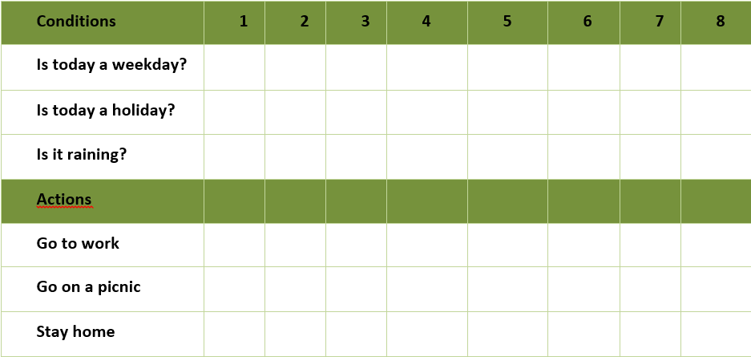
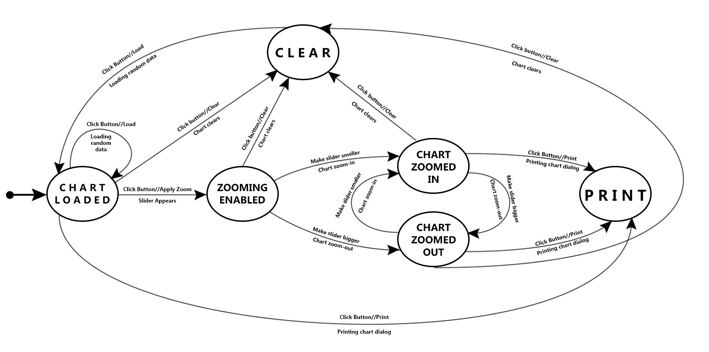
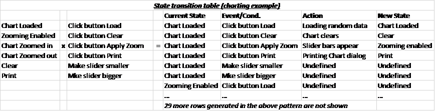

# Decision Table, State Transition Testing and Pairwise Testing Homework

## Decision Table Testing
 1. Below is a decision table for daily activities. Fill in the columns with true and false:
 
 2. A store wishes to program a decision on non-cash receipts for goods into their intelligent tills.
 
The conditions to check are agreed as:
*	Transaction under £50
*	Pays by cheque with cheque card (guarantee £50)
*	Pays by credit card

The possible actions that a cashier could take are agreed as:
*	Ring up sale
*	Call a supervisor
*	Automatic check of credit card company database

Using the rules above construct a decision table showing all possible combinations of alternatives.

## State Transition Testing

1.	For the examples perform the following:
 *	Draw a state transition diagram
 *	Determine the level of coverage
 *	Make a state transition table from the diagram
 *	Define logical test cases

**Tape player**
*	A tape player has three operations:  play, fast forward and fast play.
*	Play and fast forward are activated using the play and fast forward button respectively. These operations can be cancelled using the stop button.  When in play mode,  the fast forward can be used to fast play. When in fast play mode, the fast forward button can be pressed again to enter fast forward or the stop button can be used to return to play.  When in fast forward the play button can be pressed to enter play mode directly.

Make 0-switch and 1-switch coverage.

2.Using that State Transition Diagram, complete the state transition table below.
Create logical test cases based on that diagram.

## Pairwise Testing
1.	Determine the set of pairwise test cases for the examples below. Do it once by using an orthogonal array and once again – using an all-pairs algorithm

 *	Suppose you need to test compatibility of various kiosk configurations based on three major factors, each set to one of the options shown: 
Operating System: Windows XP or Linux  
Browser: Internet Explorer (Windows only), Netscape, or Opera  
Connection: DSL, dial-up, or cable  

 *	Suppose you need to test a web site and the combinations of software it should operate with, considering the following factors:  
Browser - Internet Explorer, Netscape, Mozilla, and Opera  
Plug-in - None, RealPlayer, and MediaPlayer  
Client operating system - Windows 95, 98, ME, NT, 2000, and XP 
Server - IIS, Apache, and WebLogic 
Server operating system - Windows NT, 2000, and Linux 

