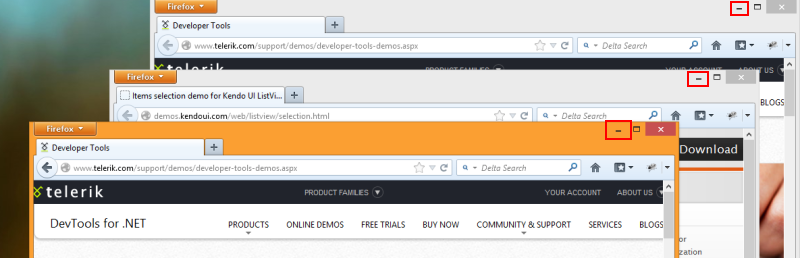

# Sikuli Homework
### Below are some sample workflows. Create Sikuli tests with basic framework.
* Go to [www.google.com](www.google.com) and search for “Telerik academy” and assert that it exists in the search results.

* Go to [http://www.dhtmlgoodies.com/scripts/drag-drop-custom/demo-drag-drop-3.html](http://www.dhtmlgoodies.com/scripts/drag-drop-custom/demo-drag-drop-3.html) and make a test for dragging and dropping elements. Make the action of positioning the capitals to their corresponding countries and verify that each country contains its own capital. 

* Make a test that minimized all active windows. For example the Firefox tabs.

Hint: Solve the task using images or shortcrust.

* Make a test that sends a message to a friend via Skype.

* Open Windows Calculator from the Star menu 
	* Check the operations of addition, subtraction, multiplication and division. Solve the task using only one image ( for ex. Calculator title, plus operator)
	* Make sure that dividing by zero is not allowed. Verify the result “Cannot divide by zero” is shown using OS clipboard.
	
* Open a browser, load [http://www.google.bg/](http://www.google.bg/), search into images tab for ‘telerik academy’, choose an image and from the context menu for it select [copy link address]. After that load into the address bar that URL.

